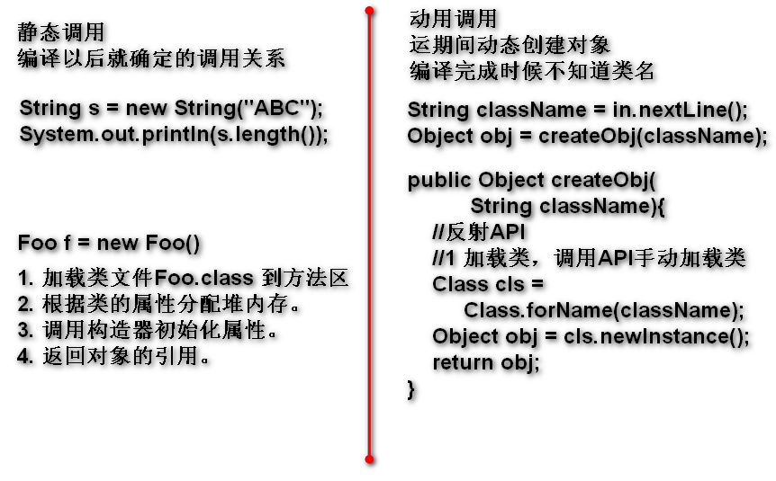
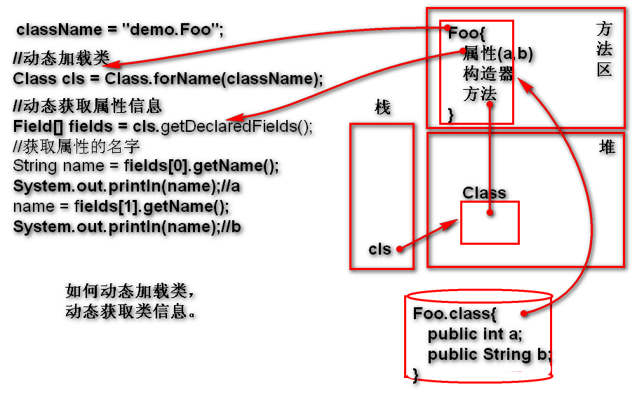

# 反射（Reflect）

Java提供的API，提供了一套动态的执行机制，可以：动态创建对象，动态访问属性，动态调用方法...

## 动态 与 静态

静态：经过 **编译以后** ，就能够确定的调用关系称为静态！
	
	String s = "abc";
	System.out.println(s.length());

动态：在 **运行期间** 动态确定的调用关系称为动态！
	
使用反射API实现代码的动态调用：

## 为什么要用动态执行？什么时候必须使用动态执行？

需求：创建一个无参数构造器类的对象，并且调用其全部以 test 为开头的无参数方法。

> 分析：类名不清楚，不能使用 new 类名()
>       不能调用方法：obj.方法()

> 结论：使用静态调用规则无法实现此需求！
> 如上需求必须使用反射API动态实现！

## 反射API提供了那些功能

### 动态加载类

> Class.forName 方法加载类：先检查方法区内存中是否已经加载类，如果已经加载，就直接返回这个类信息，如果没有加载，再加载class文件到方法区。

#### 动态加载类到方法区

Class.forName() 方法会自动的到硬盘查找className对应的*.class文件，找到以后读取验证并且加载到方法区，加载结果为方法区中的类信息（类信息包括：构造器，属性，方法等），返回一个引用，利用这个引用可以访问类信息！
当类名错误时候出现异常：ClassNotFound

代码示例：

	Scanner in = new Scanner(System.in);
	//运行期间动态获得类名
	String className = in.nextLine();
	//使用反射API动态加载类
	Class cls=Class.forName(className);
	System.out.println(cls);

### 动态获取类信息（构造器  属性  方法  ...）
> 查询 Class 类的手册 http://doc.tedu.cn

- Class 提供了获取类信息的API。

#### 动态获取属性信息

- getDeclaredFields() 返回类中全部的属性信息，返回的Filed数组。
- Field 类封装了一个属性相关信息：修饰词，数据类型，属性名等

	类信息结构：cls{ Field[]{ Filed {属性名，类型}}}

案例：

	String className = "demo.Koo";
	//动态加载类
	Class cls = Class.forName(className);
	//动态获取属性信息
	Field[] fields = 
			cls.getDeclaredFields(); 
	//Field 封装了一个属性相关的信息
	System.out.println(fields.length);
	//getName() 获取属性的名
	System.out.println(
			fields[0].getName());
	System.out.println(
			fields[1].getName());

> Eclipse 就是利用反射API实现了，动态显示一个对象有哪些属性的！

### 动态创建对象

在运行期间根据一个动态的类名动态的创建对象，在运行期间根据任意的类名，创建其对象.

#### 动态调用无参数构造器创建对象

1. Class API 提供了创建对象的方法
	- newInstance() 返回创建好的对象
2. 这个API要求类一定有无参数构造器
	- 如果没有无参数构造器，抛出无此方法异常！
3. 利用这个方法可以动态创对象！

#### 动态调用有参数构造器创建对象

### 动态访问属性

### 动态调用方法   

## 实现一个经典案例：动态调用test开头方法

