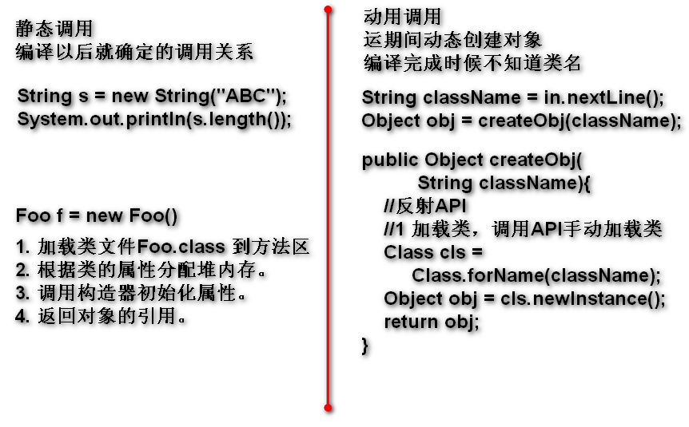
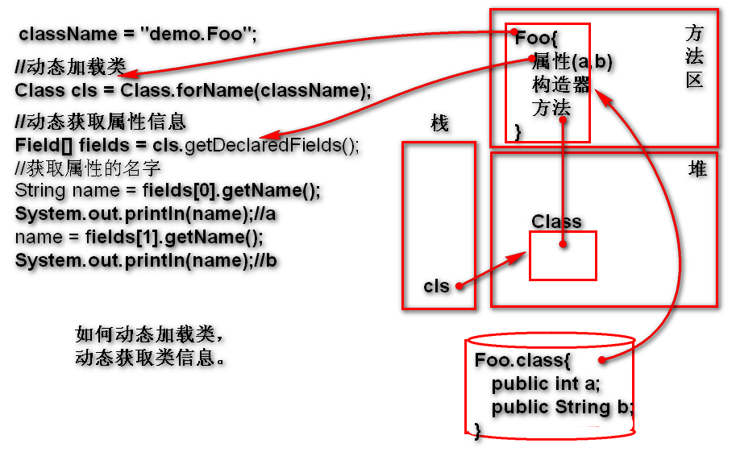

# 反射（Reflect）

Java提供的API，提供了一套动态的执行机制，可以：动态创建对象，动态访问属性，动态调用方法...

## 动态 与 静态

静态：经过 **编译以后** ，就能够确定的调用关系称为静态！
	
	String s = "abc";
	System.out.println(s.length());

动态：在 **运行期间** 动态确定的调用关系称为动态！
	
使用反射API实现代码的动态调用：

## 为什么要用动态执行？什么时候必须使用动态执行？

需求：创建一个无参数构造器类的对象，并且调用其全部以 test 为开头的无参数方法。

> 分析：类名不清楚，不能使用 new 类名()
>       不能调用方法：obj.方法()

> 结论：使用静态调用规则无法实现此需求！
> 如上需求必须使用反射API动态实现！

## 反射API提供了那些功能

### 动态加载类

> Class.forName 方法加载类：先检查方法区内存中是否已经加载类，如果已经加载，就直接返回这个类信息，如果没有加载，再加载class文件到方法区。

#### 动态加载类到方法区

Class.forName() 方法会自动的到硬盘查找className对应的*.class文件，找到以后读取验证并且加载到方法区，加载结果为方法区中的类信息（类信息包括：构造器，属性，方法等），返回一个引用，利用这个引用可以访问类信息！
当类名错误时候出现异常：ClassNotFound

代码示例：

	Scanner in = new Scanner(System.in);
	//运行期间动态获得类名
	String className = in.nextLine();
	//使用反射API动态加载类
	Class cls=Class.forName(className);
	System.out.println(cls);

### 动态获取类信息（构造器  属性  方法  ...）
> 查询 Class 类的手册 http://doc.tedu.cn

- Class 提供了获取类信息的API。

#### 动态获取属性信息

- getDeclaredFields() 返回类中全部的属性信息，返回的Filed数组。
- Field 类封装了一个属性相关信息：修饰词，数据类型，属性名等

	类信息结构：cls{ Field[]{ Filed {属性名，类型}}}

案例：

	String className = "demo.Koo";
	//动态加载类
	Class cls = Class.forName(className);
	//动态获取属性信息
	Field[] fields = 
			cls.getDeclaredFields(); 
	//Field 封装了一个属性相关的信息
	System.out.println(fields.length);
	//getName() 获取属性的名
	System.out.println(
			fields[0].getName());
	System.out.println(
			fields[1].getName());

> Eclipse 就是利用反射API实现了，动态显示一个对象有哪些属性的！

#### 动态显示一个类全部方法信息

- 使用Class提供的API getDeclaredMethods() 
	- 返回一个Method[]数组代表多个方法信息
	- 每个Method对象封装了一个方法的信息（返回值，方法名，参数列表）
		- getReturnType() 返回值类型
		- getName() 返回方法名
		- getParameterTypes() 参数列表
- 步骤：
	1. 动态加载类
	2. getDeclaredMethods()
	3. for()遍历每个方法信息
		- 显示每个方法信息

#### 动态显示一个类全部构造器信息

- 使用Class提供的API方法获取全部构造器信息getDeclaredConstructors() 
	- 返回一个数组Constructor[]
	- 每个Constructor元素：包含一个构造器的信息：方法名，参数列表等
- 步骤:
	1. 动态加载类
	2. 调用方法getDeclaredConstructors() 
	3. for遍历每个构造器信息

### 动态创建对象

在运行期间根据一个动态的类名动态的创建对象，在运行期间根据任意的类名，创建其对象.

#### 动态调用无参数构造器创建对象

1. Class API 提供了创建对象的方法
	- newInstance() 返回创建好的对象
2. 这个API要求类一定有无参数构造器
	- 如果没有无参数构造器，抛出无此方法异常！
3. 利用这个方法可以动态创对象！

#### 动态调用有参数构造器创建对象

任何类型，任何一个构造器，传递任何参数

	静态创建对象
	ArrayList list = new ArrayList(200);

	动态调用构造器：类名不知，参数不知，那个构造器不确定。

- 使用反射API实现
- 使用Class.forName 动态加载类
- Class 的方法 getDeclaredConstructor(参数类型列表)，查找到一个与参数类型列表匹配构造器，返回两种情况：
	- 找到返回Constructor对象：构造器信息
	- 找不到：抛出异常，方法没有找到
	- 参数类型列表: 
		- Class类型数组，元素是Class类型
		- 整数的类型：int.class 
		- double的类型：double.class
		- String的类型： String.class
		- 类型列表(int,int,String)：new Class[]{int.class, int.class, String.class};
- 执行构造器创建对象
	- Constructor 类提供了 newInstance(参数列表)，执行有参数构造器.
	- 要求参数列表与构造器参数类型匹配。否则抛出参数类型错误异常！
	- 构造器执行期间出现异常，目标调用异常
	- 参数列表(5,8,"Tom")：
		- Object[]数组
		- new Object[]{5,8,"Tom"};
	- 返回值是一个对象！

> 在工作中调用无参数构造器创建对象，使用频率最高！Class.newInstance()!!!

### 动态访问属性

> 属性一定属于对象。访问对象的属性。

- 使用反射API访问，某对象的某个属性
	- 动态：对象不明，属性不知
- 如何使用:
	1. 找到对象的Class {a=100}
		- Object 提供了方法 getClass() 返回此对象的Class信息（方法区中的信息）
	2. 找到属性信息：{a}
		- Class.getDeclaredField(属性名)根据属性名找到属性信息。
	3. 属性信息Filed类提供了访问属性的方法
		- Field.get(被访问对象) 返回属性的值，理解为：在对象上读取属性值(回去a的值100)
		- Field.set(被访问对象，值) 设置属性的值

### 动态调用方法   

> 调用”某对象“的”某个方法“，传递”某些参数“

- 使用反射API访问，某对象的某个方法
	- 动态：对象不明，方法不明，参数不明
- 实现方法：
	1. 找到Class：obj.getClass()
	2. 找到被执行的方法信息Method
		- Class.getDeclaredMethod(方法名，参数类型列表)，返回对应方法信息
	3. 执行Method信息类的 invoke() 方法
		- Method.invoke(参数列表) 返回值是方法执行的结果

## 实现一个经典案例：动态调用某对象test开头方法(JUnit 3)

必须使用反射实现：
1. 类型不明
2. 方法不明

做法：
1. 动态加载类
2. 动态调用无参数构造器创建对象
3. 找到全部的方法信息
	- 遍历，检查那个方法信息以test为开头，而且方法参数类型的长度是0：找到以test为开头的参数方法。
4. 执行这个方法 method.invoke()

