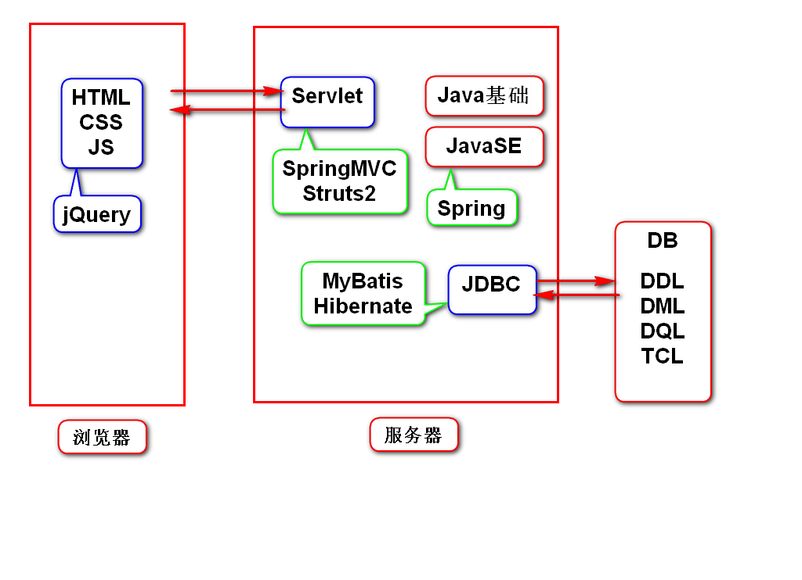
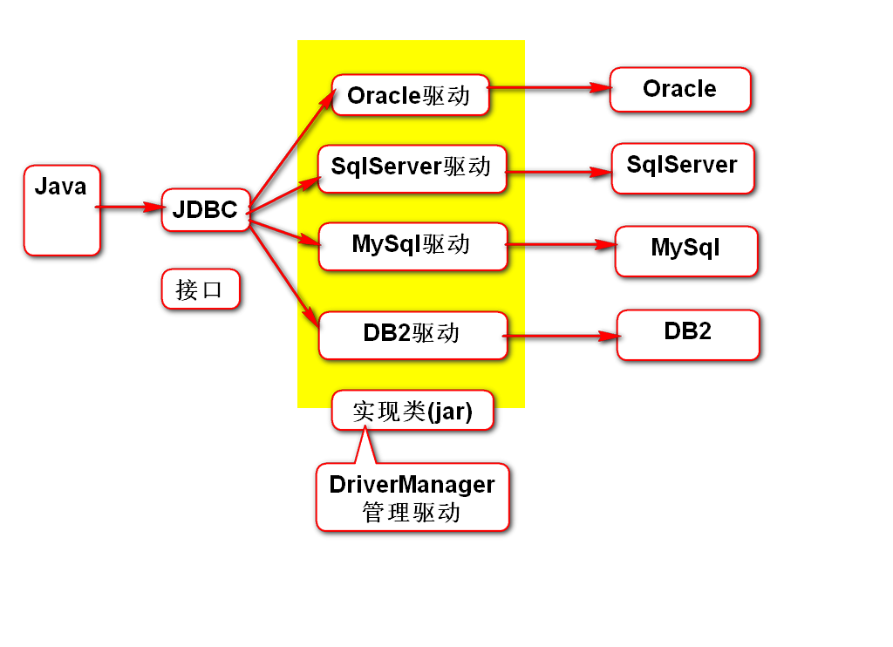
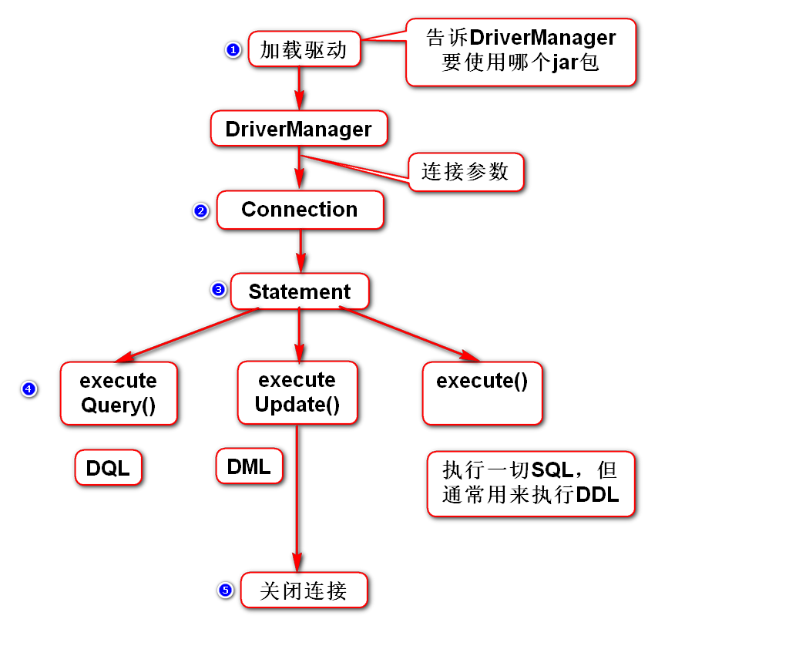
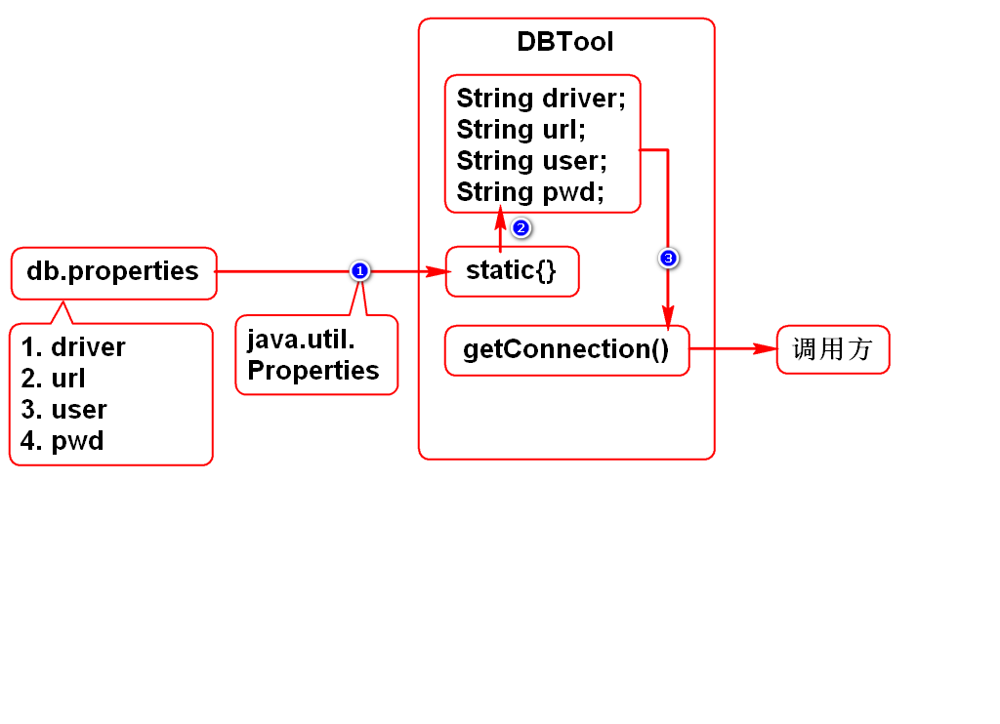
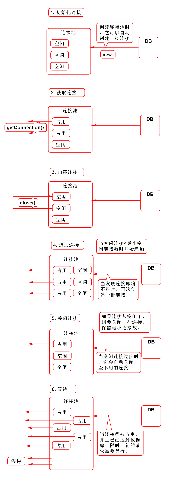

李洪鹤/lihh@tedu.cn

#Java体系

#JDBC
##什么是JDBC
  是Sun推出的Java访问数据库的解决方案
##JDBC的要点
  1. 接口(1套)
    由Sun提出的。
  2. 实现类(n套)
    由数据库厂商加以实现。
##特点
  只需要掌握接口的API

#JDBC的使用步骤
1. 加载(注册)驱动
2. 创建连接
3. 创建Statement
4. 执行SQL
5. 关闭连接

#管理连接
##封装创建连接的过程

##properties
1. 用该类型文件存储简单参数，
  是Java的经典用法。
2. 该文件内容的结构
 - key=value
 - key=value
 - 不要有多余的空格和符号
3. 如何读取文件
 - 使用Java.util.Properties读取此类文件
 - 它就是散列表(哈希)，其特点是查询快

#连接池
##直接使用DriverManager的问题
 - 使用DriverManager创建连接，是无节制的。
 - 只适用于单线程的软件。
 - 如果存在大量并发，有可能达到数据库
   连接上限，导致其崩溃。
##使用连接池解决该问题
 - 连接池可以对连接加以管理
 - 可以使得连接能复用，提高效率
 - 连接池会限制最大连接数，避免达到上限
##常用连接池
 - DBCP
 - C3P0
