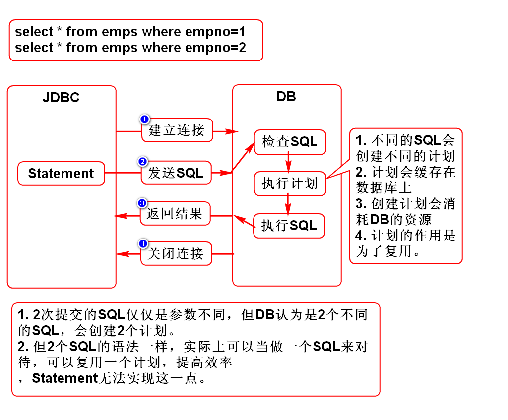
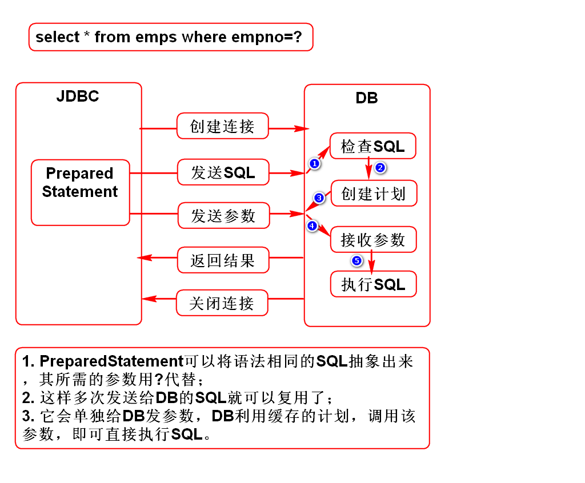
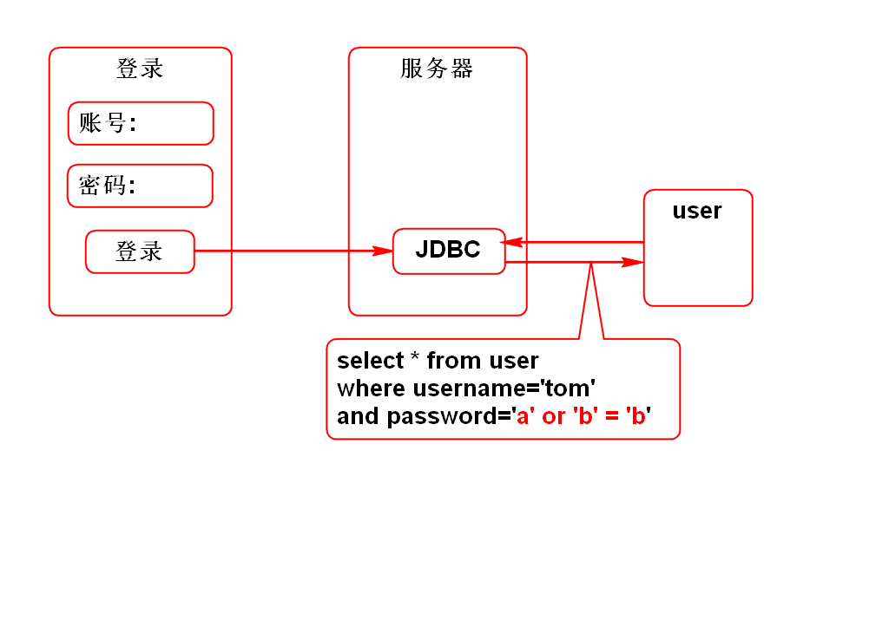
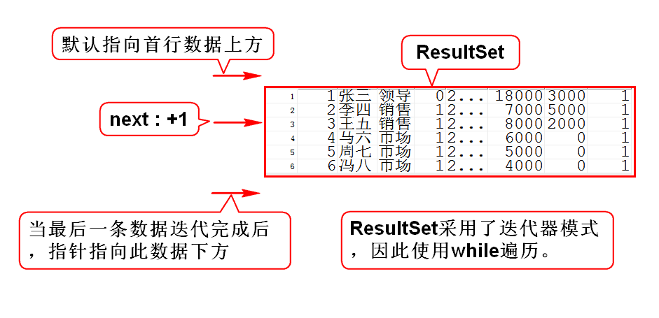
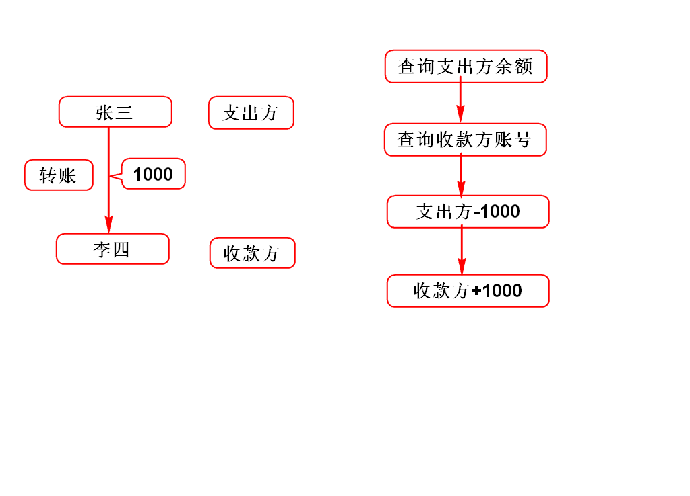

# Statement
 - 适合执行静态(无条件)的SQL
 - 通常用它来执行DDL
 

# PreparedStatement
 - 适合执行动态(有条件)的SQL
 - 通常用它来执行DML、DQL
 

# JDBC中的日期
支持3个日期类型，他们都继承于java.util.Date
 - java.sql.Date 年月日
 - java.sql.Time 时分秒
 - java.sql.Timestamp 年月日时分秒

# 注入式攻击
1. Statement存在的漏洞
 登录时，用户若输出特殊的字符串作为密码，
 将会直接登录成功，导致系统存在漏洞。
	select * from users_lhh
	where username='tom'
	and password='a' or 'b' = 'b';
2. PreparedStatement可以避免该漏洞
	select * from users_lhh
	where username=? and password=?
 PreparedStatement在执行SQL时，无论传入
 什么参数，都以原有SQL含义来执行，不
 允许改变SQL的本意。
 
 
# ResultSet

# ResultSetMetaData
1. MetaData：元数据
 - 元：根本、本质
 - 元数据：数据的本质
 - 数据的概述、数据的描述
 - 用来描述数据的数据
2. ResultSetMetaData
 - 结果集的元数据
 - 用来描述结果集中数据的数据
 - 多少列/列名/列的类型

# 转账流程
