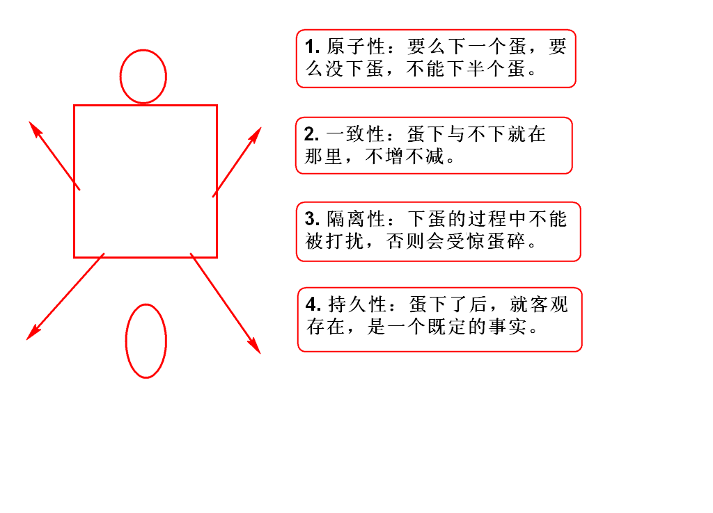
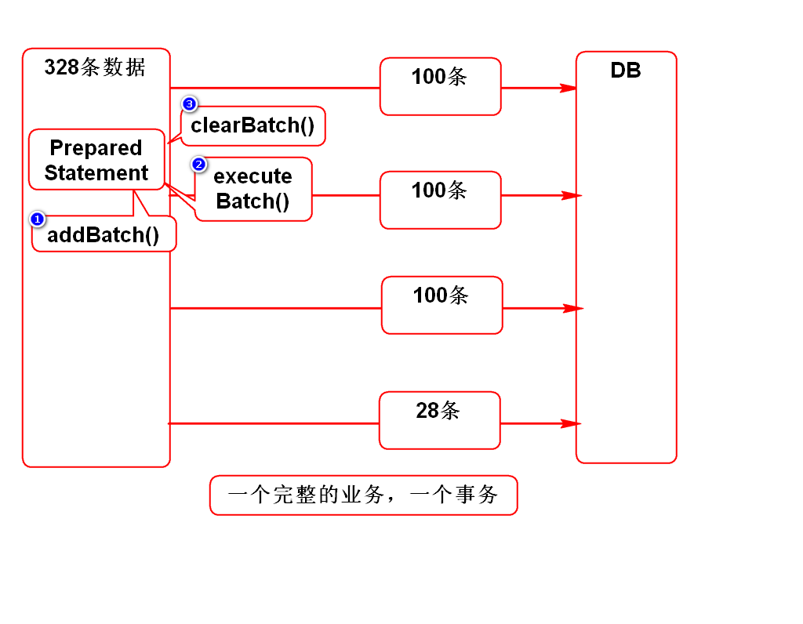
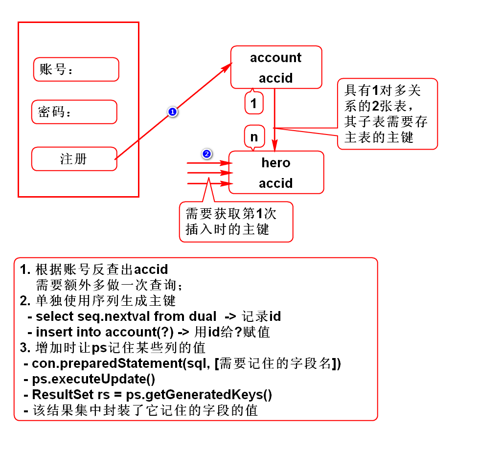
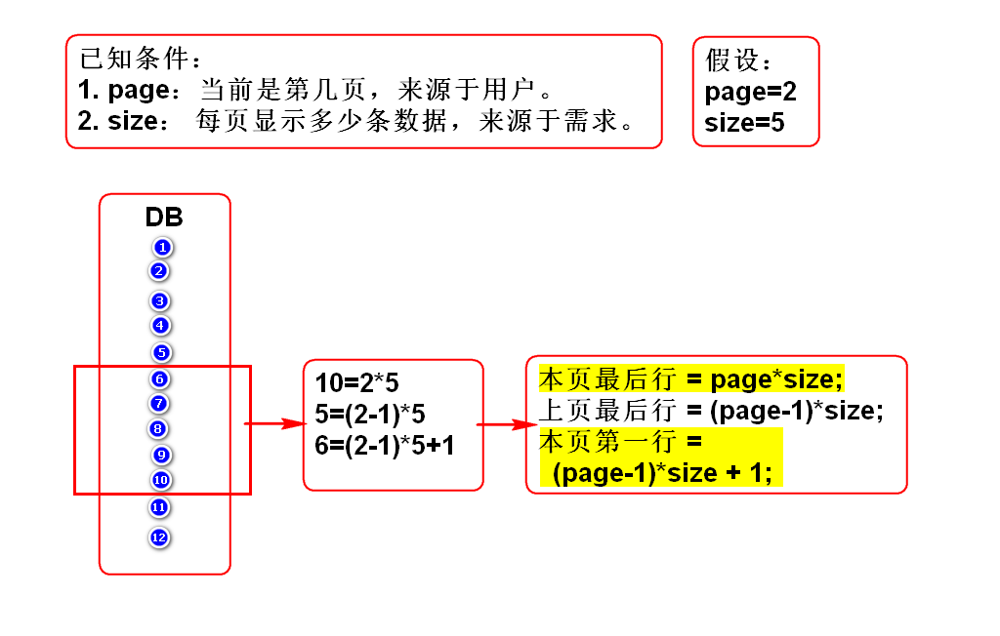
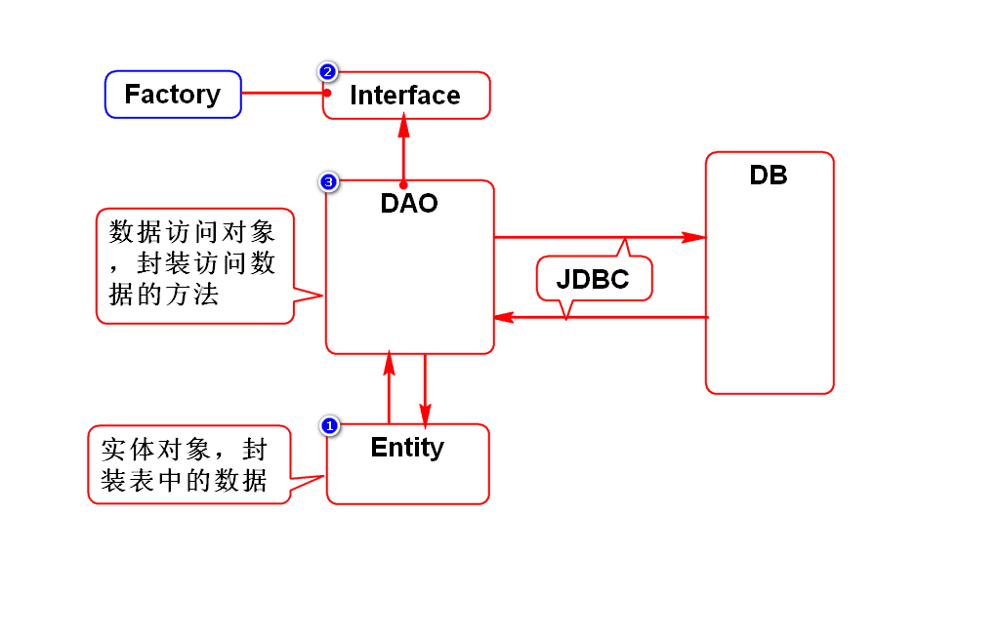
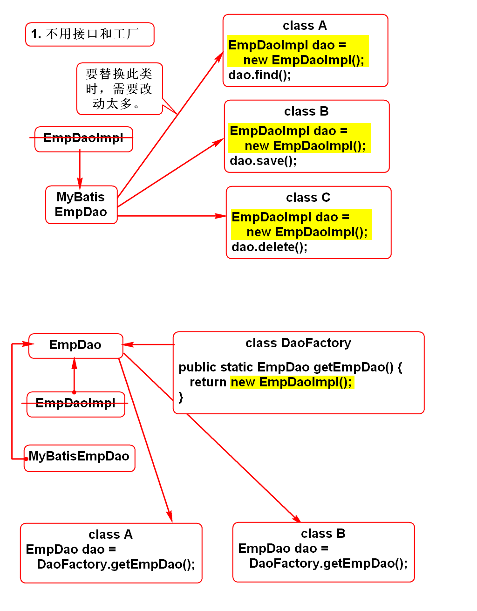

# 事务
## 什么叫做事务
 满足如下4个特性的数据库访问叫事务。
 1. 原子性
   事务是一个完整的过程，要么都成功，
   要么都失败。
 2. 一致性
   事务前后的数据要保持一致，即收支平衡。
 3. 隔离性
   事务过程内的数据不能被其他线程访问。
 4. 持久性
   事务一旦达成，就永久有效。
## 如何实现事务
 1. 大部分的数据库都支持ACID，即事务。
 2. JDBC对事务支持
  - 默认就支持事务，即在executeUpdate()
    时它会自动提交事务。
  - 也可以手动处理事务：
	con.setAutoCommit(false);
	con.commit();
	con.rollback();

# 批量添加数据

# 返回自动生成的主键

# 分页
## 真分页(物理分页)
1. 利用数据库分页的SQL实现的分页；
2. 每次查询只返回某一页的数据；
3. 优缺点
 - 每次只查一页数据，速度都一样；
 - 内存中只存一页数据，占用小；
4. 适用于所有项目
5. Oracle分页的SQL
	select * from (
		select e.*, rownum r from (
			select * from emps 
			order by empno
		) e
	) where r between 1 and 10
6. MySql分页的SQL
	select * from emps
	order by empno
	limit 1,10

## 假分页(内存/缓存分页)
1. 先(首次)查询出所有的数据，存入List；
2. 再从List中找出某一页的数据；
3. 优缺点
 - 首次查询数据过多，很慢；
 - 所有数据都存入内存，耗内存；
 - 后续直接从内存中取数，速度快；
4. 适用于数据量很少的项目

# DAO
1. 将数据库访问的方法封装成DAO对象
2. 将表中的数据封装成entity(实体)对象

3. 接口和工厂类的作用

