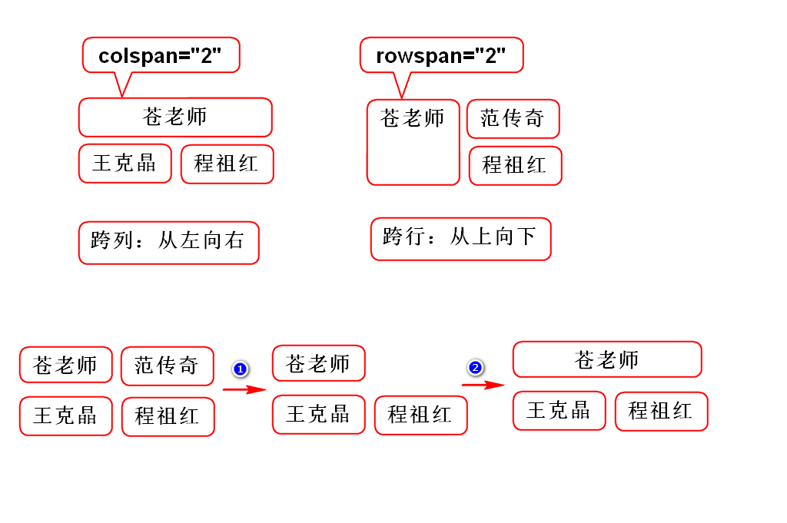
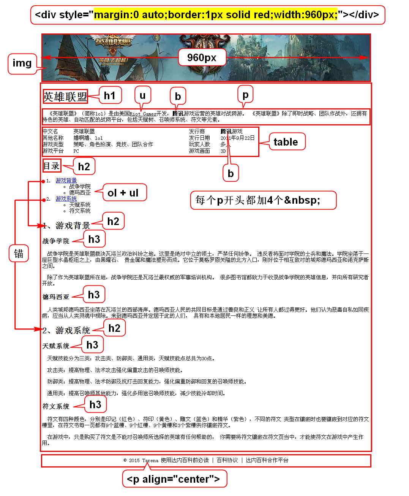

# WebBasic
## 目的
 教会大家如何做网页。
## 为什么要学习做网页？
1. Java程序员绝大部分都是做Web项目
2. 带有网页的项目是Web项目
## 构成
1. HTML
 勾勒出网页的结构和内容
2. CSS
 用来美化网页
3. JavaScript(JS)
 让网页呈现动态的数据和效果
## 重点
1. 美工用HTML+CSS做出静态的网页
2. Java程序员用JS做出网页动态的效果
> JS操作的目标是HTML+CSS，所以要学会JS
> 必须先掌握HTML+CSS。

# Web概述

# XML和HTML的关系
## XML
1. XML是可扩展(自定义)标记语言
 - 标签可扩展
 - 属性可扩展
 - 标签之间的嵌套关系可扩展
2. 用来存储或传输数据
3. 语法
 - 双标签:<student></student>
 - 单标签:<student/>
 - 单标签=内容为空的双标签
 - 属性:<student id="1"></student>
 - 元素:<student id="1">张三</student>
## HTML
1. 是超文本标记语言，它的标签是固定的。
2. 用来显示数据的。
3. HTML有特定的版本就严格遵守了XML规范。
4. 可以理解为HTML就是标签固定的XML，
 学习HTML就是学习这些固定的标签。

# table

# lol
