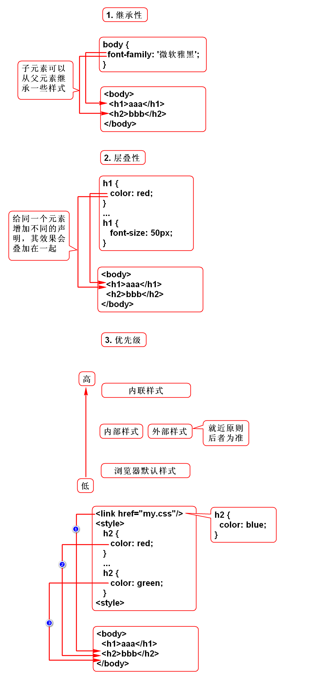

# 手册
1. 书上只列举了部分属性。
2. 全部的属性可以从手册查询到。
3. www.w3school.com.cn

# 表单

# CSS的用法
## 内联样式
 - 在元素的style属性里直接写CSS
 - 简单直接，但无法复用

## 内部样式
 - 在head元素中的style标签里写CSS
 - 可以在当前页面复用

## 外部样式
 - 在独立的css文件中写CSS
 - 可以被多个页面复用

# CSS特性

# RGB

