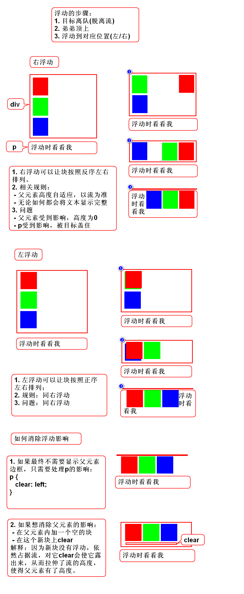
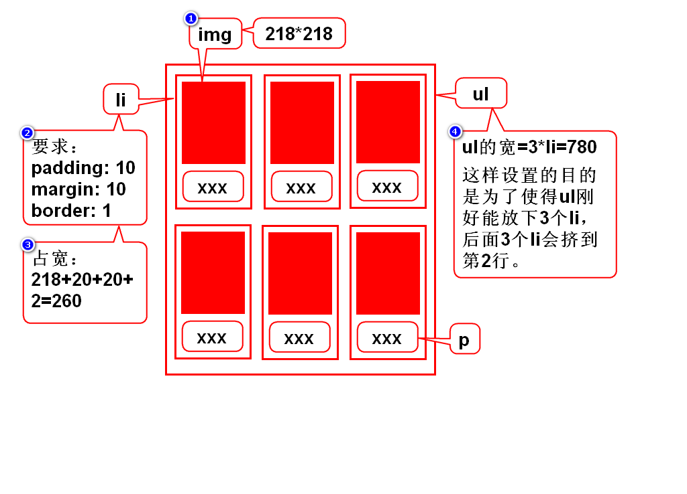
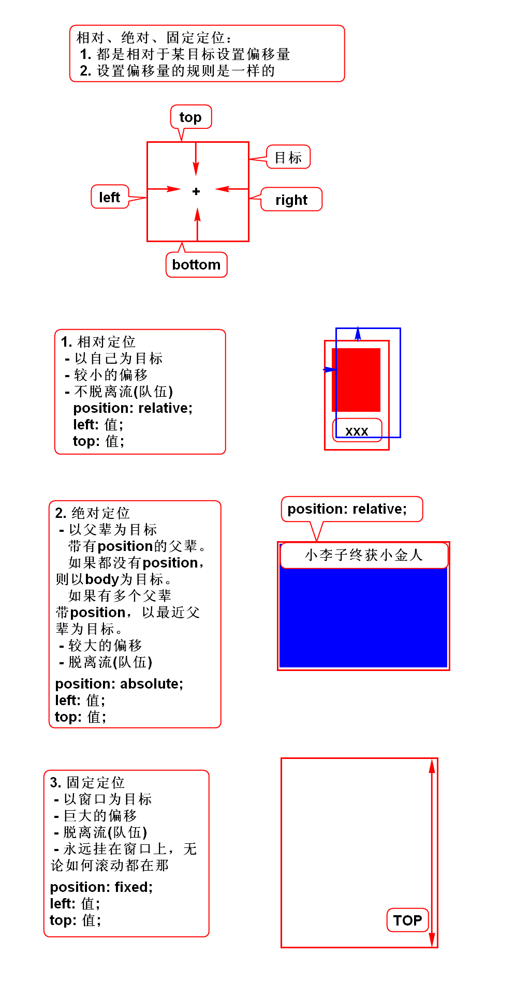
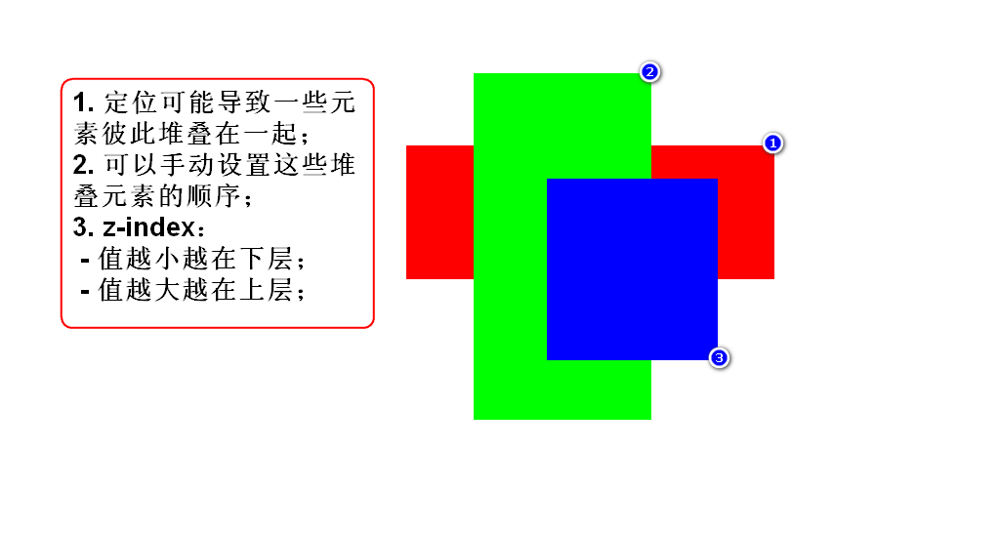
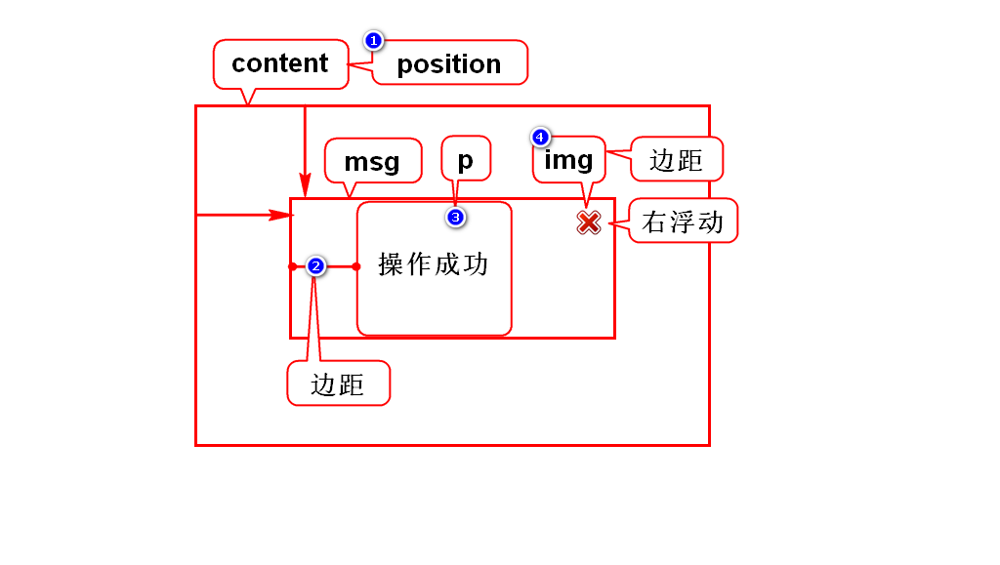
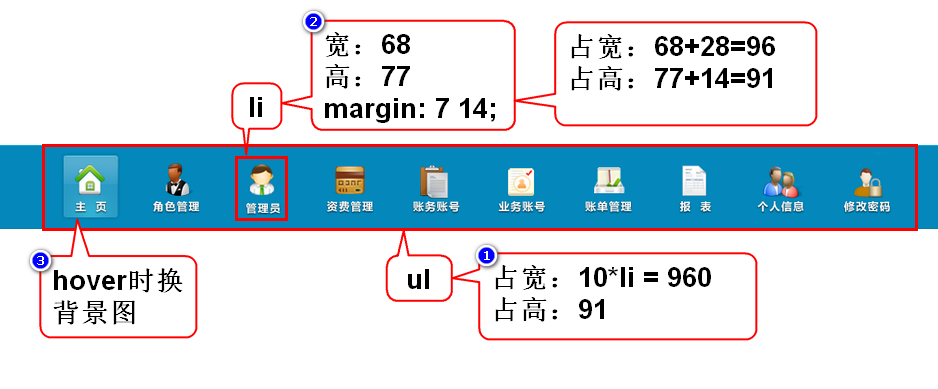

# 浮动

# 照片墙

# 相对、绝对、固定定位

# 堆叠顺序

# 消息框

# 元素的显示方式(display)
## 块(block)
### 块的特点
1. 块独立成行，即垂直排列
2. 块有宽高

### 举例
hn/p/div/ol/ul/table

## 行内(inline)
### 特点
1. 不独立成行，即左右排列
2. 没有宽高

### 举例
span/b/strong/i/em/u/del/a

## 行内块(inline-block)
### 特点
1. 不独立成行，即左右排列
2. 有宽高

### 举例
img/input/select/textarea

## 修改显示方式
1. 通过display修改
 - block
 - inline
 - inline-block
 - none，表示元素隐藏，同时释放位置。

# 导航栏
