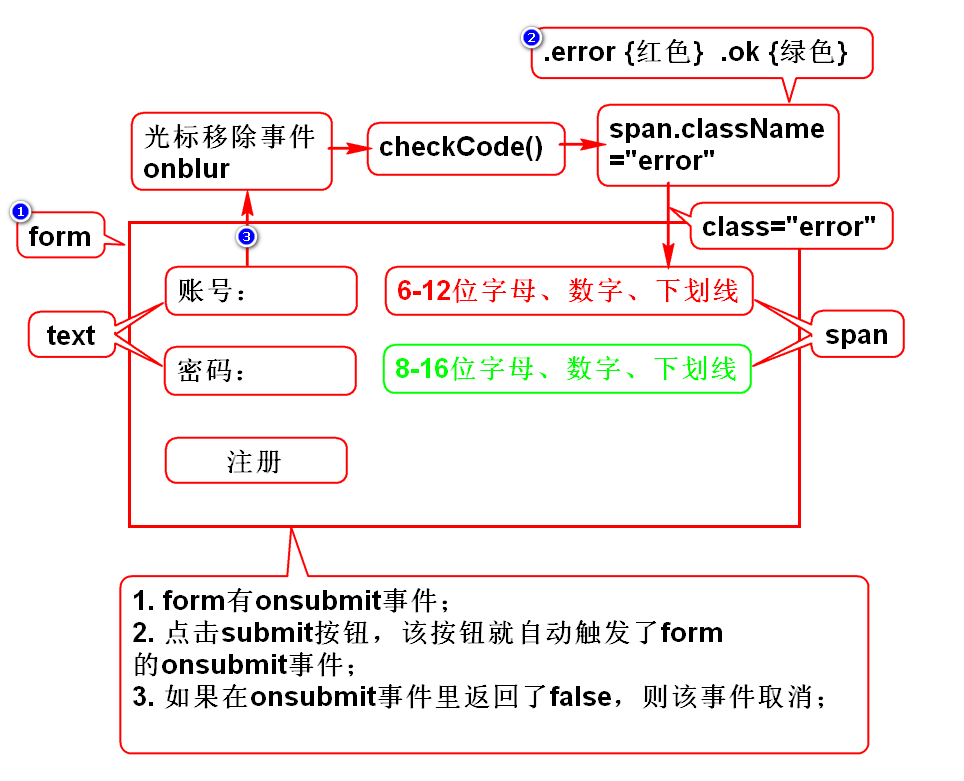
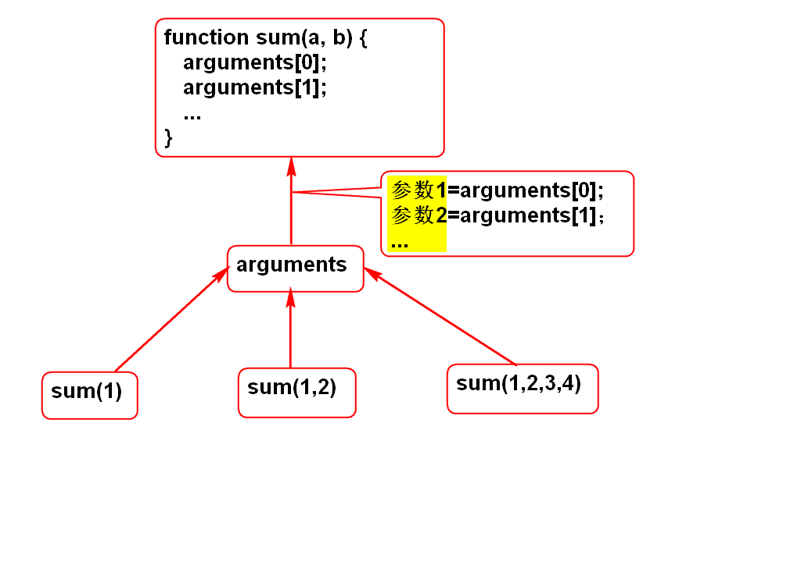
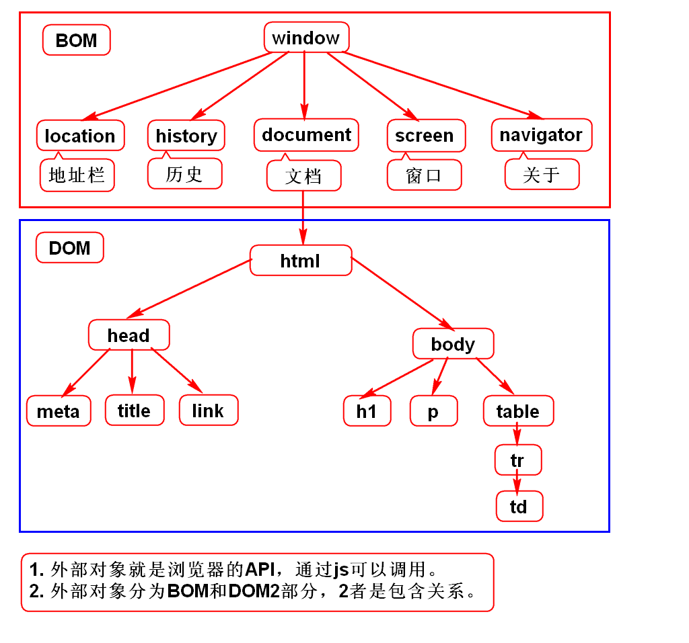
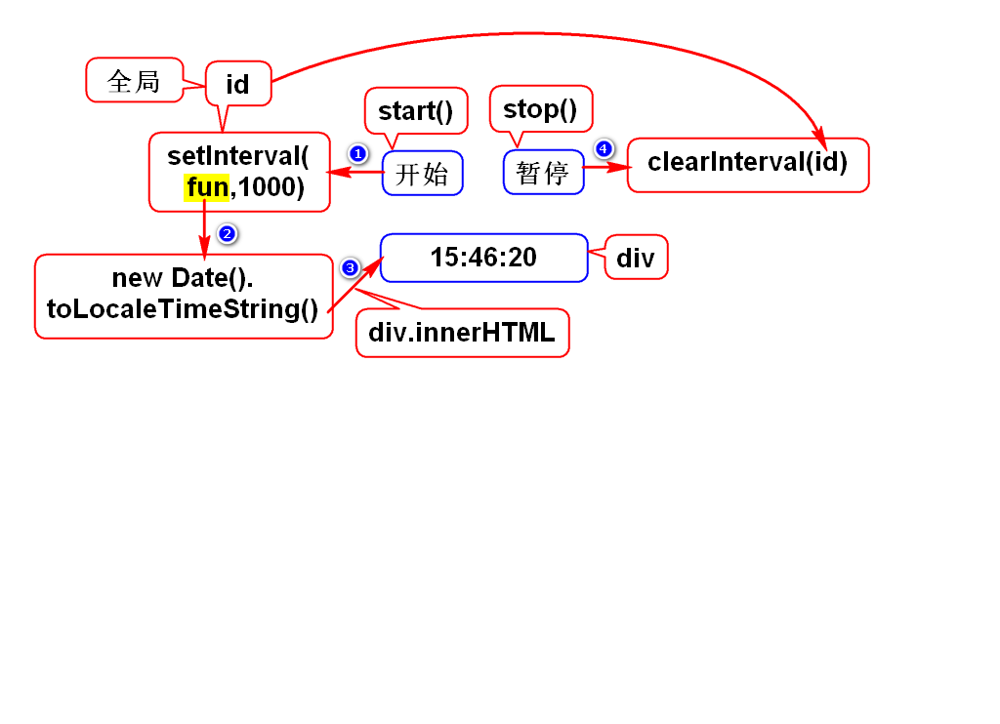
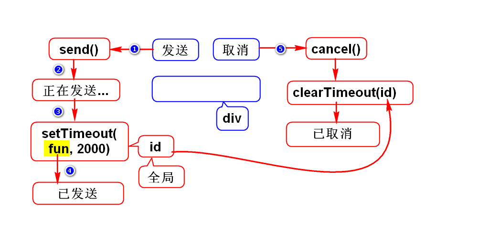

# RegExp
## 1.如何创建正则对象
### 1)直接量
var reg = /\d{3}/g;

### 2)对象
var reg = new RegExp("\\d{3}","g");

### 3)模式
 - 全局模式：g
 - 忽略大小写模式：i

## 2.正则对象的方法
### *1)reg.test(str)
 - 判断str中是否包含与reg匹配的部分
 - 举例
	var str = "no zuo no die no can no bb";
	var reg = /no/;
	reg.test(str); //true

### 2)reg.exec(str)
 - 找出str中和reg匹配的部分
 - 全局模式
	var str = "no zuo no die no can no bb";
	var reg = /no/g;
	reg.exec(str);//1 no
	reg.exec(str);//2 no
	reg.exec(str);//3 no
	reg.exec(str);//4 no
	reg.exec(str);//null
 - 普通模式
	var str = "no zuo no die no can no bb";
	var reg = /no/;
	reg.exec(str);//1 no
	reg.exec(str);//1 no

## 3.字符串中支持正则的方法
### 1)str.replace(reg,目标)
 - 将str中和reg匹配的部分替换成目标
 - 举例
	var str = "no zuo no die no can no bb";
	var reg = /no/g;
	str.replace(reg,"bu");

### 2)str.match(reg)
 - 从str中找出和reg匹配的部分
 - 举例
	var str = "no zuo no die no can no bb";
	var reg = /no/g;
	str.match(reg);//["no","no","no","no"]

### 3)str.search(reg)
 - 从str中找出和reg首次匹配的索引
 - 举例
	var str = "no zuo no die no can no bb";
	var reg = /no/g;
	str.search(reg);//0

# 注册校验

# arguments

# 外部对象

# 电子表

# 发送消息
