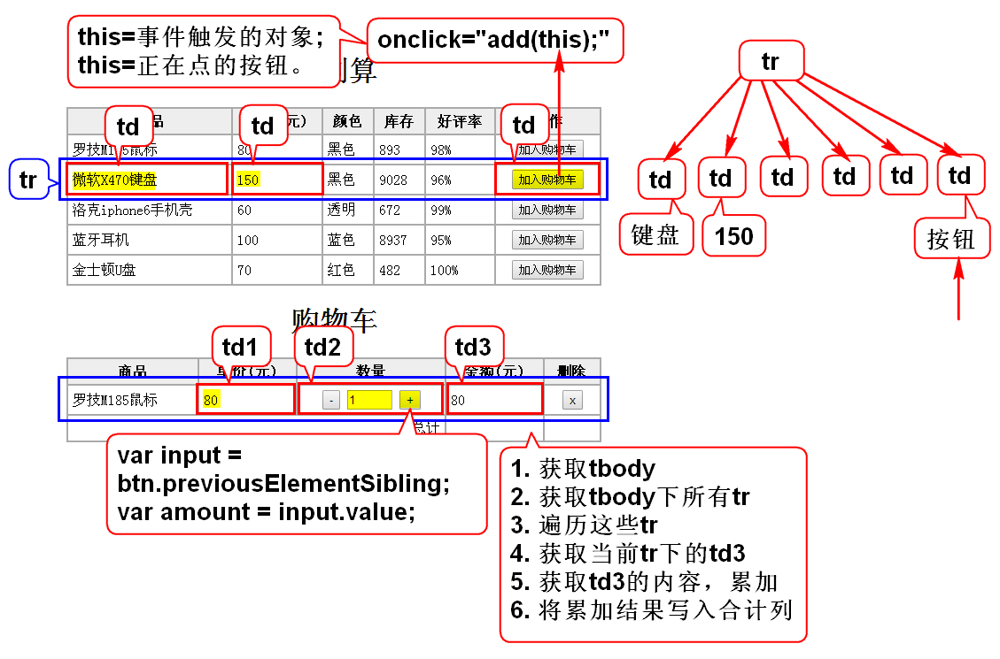
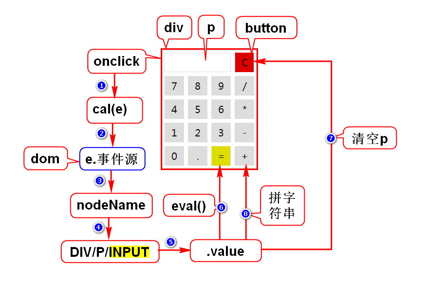

# 购物车

# 创建自定义对象
## 直接量(json)
 - var student = {"name":"zs","age":23};
 - key通常都写成字符串；
 - value可以是任意类型的数据；

## 构造器(new的函数)
### js自带的构造器
 - new Date();
 - new RegExp("","");
 - new Function();
 - new Object();

### 自定义的构造器
	function Coder(name,age,work){
		this.name = name;
		this.age = age;
		this.work = work;
	}
	new Coder();

## create方法
 - 最新的js标准提出的方法；
 - 很多浏览器还没有支持；

## 总结
1. 无论何种方式创建的对象都是Object。
2. 使用场景
 - 自定义对象数据结构比较直观，适合要求复用的函数。
 - 自己使用的数据要封装，若已知数据则用直接量。
 - 自己使用的数据要封装，若未知数据则用Object。

# 事件冒泡
## 什么是事件冒泡
就是事件的传播机制，在js里事件由内向外传播。

## 事件冒泡的作用
可以简化事件的定义，在父元素上定义一次事件，
可以捕获到所以子元素上的事件。

## 问题
 - 使用事件冒泡时必须知道事件发生的具体位置
 - 事件发生的具体位置/来源称之为事件源
 - 通过event可以直接获取事件源

# 计算器
