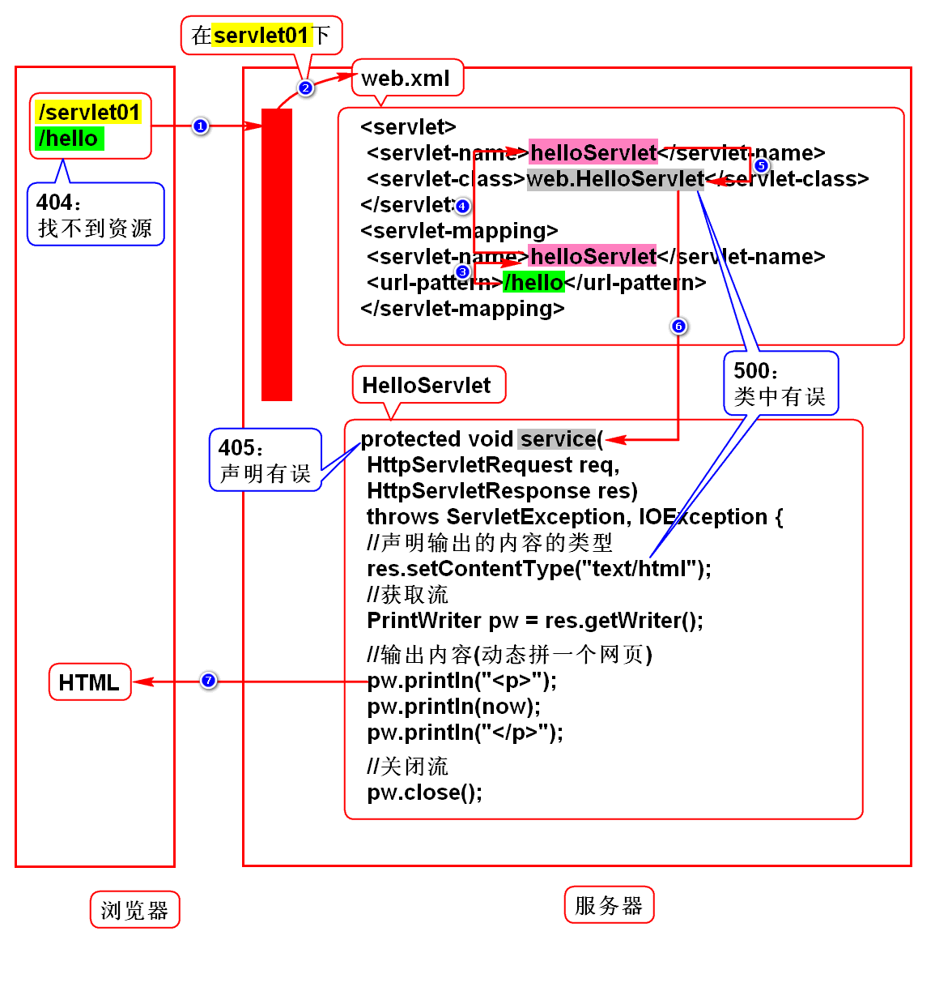
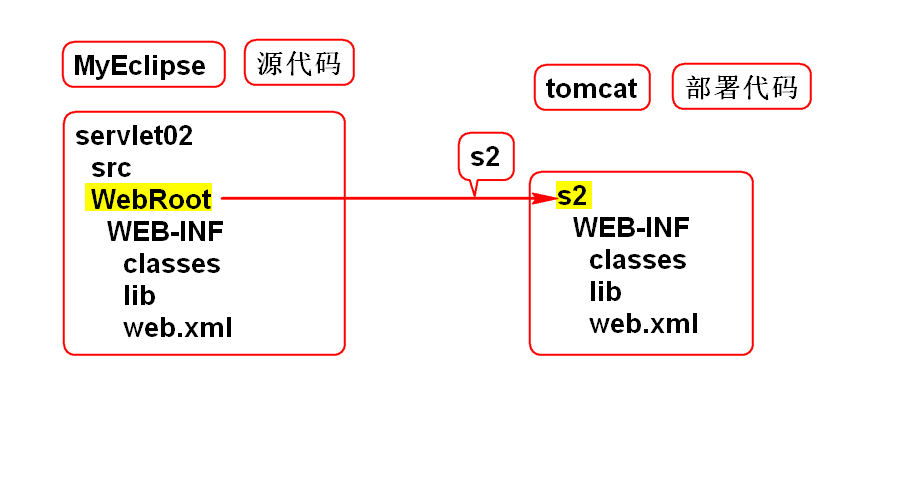

# Web项目的发展
1. 单机 -> 网络
2. CS(Client Server) -> BS(Browser Server)

# Servlet
## 如何访问网页
### 静态
- 新闻页、百科页
- 服务器直接返回静态HTML

### 动态
- 微博、淘宝
- 访问服务器端的某组件，由它动态拼一个
  HTML返回给浏览器
- 在Java项目中该组件就是Servlet
> 组件：满足规范的对象

## Servlet特征
- Servlet可以动态拼HTML/图片等动态资源
- Servlet是服务端的组件，必须在服务器
  上才能运行。
- Servlet是Sun推出的，是有规范的组件。

## 什么是Servlet
Servlet是Sun推出的，用于在服务器端
处理HTTP协议(拼动态资源)的组件。

# 服务器
## 名称
- Java服务器
- Java Web服务器
- Web服务器
- Servlet容器

## 本质
- 不是硬件
- 是一个软件
- 和浏览器平级

## 举例
- Tomcat
- JBoss
- WebLogic
- WebSphere

# Tomcat
## Linux
1. 配置JAVA_HOME
2. 现场：/home/soft01/tts9/apache-tomcat-7
  远程：
  /文件系统/opt/apache-tomcat ->
  /文件系统/home/soft01下
3. 在/tomcat/bin/下，终端命令./startup.sh
  (chmod +x *sh)
4. 浏览器输入http://localhost:8080，回车后
  看到一只猫就代表成功了。
5. 在/tomcat/bin/下，终端命令./shutdown.sh

## Windows
1. 配置JAVA_HOME
2. 解压tomcat.zip
3. 在/tomcat/bin下，双击startup.bat
4. 浏览器输入http://localhost:8080，回车后
  看到一只猫就代表成功了。
5. 在/tomcat/bin下，双击shundown.bat

# 用MyEclipse管理Tomcat
## 配置tomcat
1. 点击服务器图标->Configure Server
2. 选择Servers->Tomcat->Tomcat7.x
3. 点击Enable
4. 点击Browse，在弹出框中选择tomcat根目录
5. Apply
6. 选择Tomcat7.x/JDK
7. 选择JDK
> 如果在Tomcat6.x下配置tomcat7，
> 选择Tomcat6.x/Paths，在右侧第一个框，
> Add Jar，选择tomcat7/bin/juli.jar。

## 使用tomcat
### 服务器图标
Tomcat7.x -> Start/Stop Server

### Servers
1. window->show view->others->Servers
2. Run Server(绿三角)启动Tomcat
3. Stop Server(红方块)关闭Tomcat

# Servlet规范
## Web项目的规范
1. 目录结构
	WebRoot
		WEB-INF
			classes
			lib
			web.xml
2. 说明 
- WebRoot可以任意命名
- classes用来存放class文件
- lib下放jar包
- web.xml用来配置Servlet
3. 开发
MyEclipse创建web项目，自带此结构

## Servlet的规范
1. 实现Servlet接口
2. 继承于HttpServlet
> HttpServlet implements Servlet

# 部署(拷贝)
1. Servers -> Add Deployments(黑色按钮)
2. 选择项目 -> Finish

# 常见错误
## 404
1. 资源找不到
2. 检查浏览器路径

## 500
1. 类写错
2. 检查web.xml中的类名
3. 检查service方法内的代码

## 端口被占用
### 启动tomcat时，控制台报错：
	Address already in use
	JVM_BIND:8080

### 原因1
- 在未关闭tomcat时就重新启动了tomcat
- 需要手动shutdown

### 原因2
- 安装了某软件，它占用了8080端口
- 修改Tomcat端口
- 打开/tomcat/conf/server.xml，
  搜8080(70行)，进行修改(8088/8089)。
- 修改后要重启Tomcat

# Servlet执行过程

# 重新部署
### 删除部署项目
Servers->Tomcat7.x->项目->右键->remove

### 重新部署项目
Servers->Tomcat7.x->项目->右键->redeploy

# 源代码和部署代码的关系

# HTTP
## 什么是HTTP协议
该协议规定了浏览器和服务器如何通信，
以及通信的数据格式。

## 如何通信
1. 建立连接
2. 发送请求
3. 发送响应
4. 关闭连接
> 上述4步已经由浏览器实现。

## 数据格式
### 请求数据包
1. 请求行：协议的基本信息
2. 消息头：描述信息
3. 实体内容：传输的数据

### 响应数据包
1. 状态行：协议的基本信息
2. 消息头：描述信息
3. 实体内容：传输的数据

## 如何在服务端处理数据
1. Java项目采用Servlet处理数据
2. request用来处理请求数据
3. response用来处理响应数据
> 浏览器已经实现了通信，也实现数据传输。
> 程序员需要知道在服务端如何接收到这份
> 传输过来的数据，以及如何给客户返回HTML。