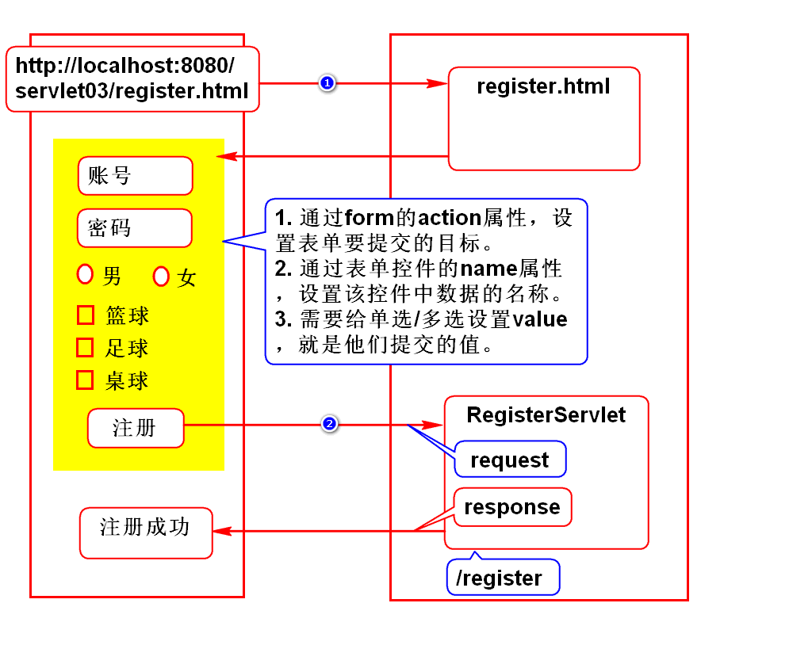
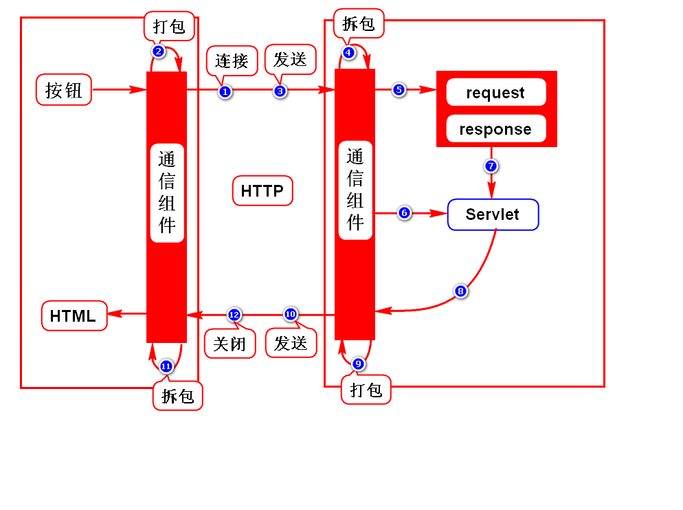
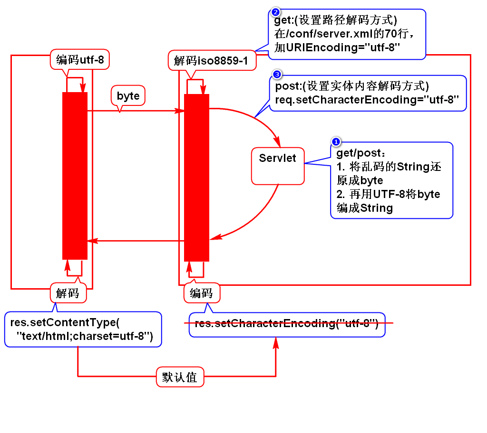
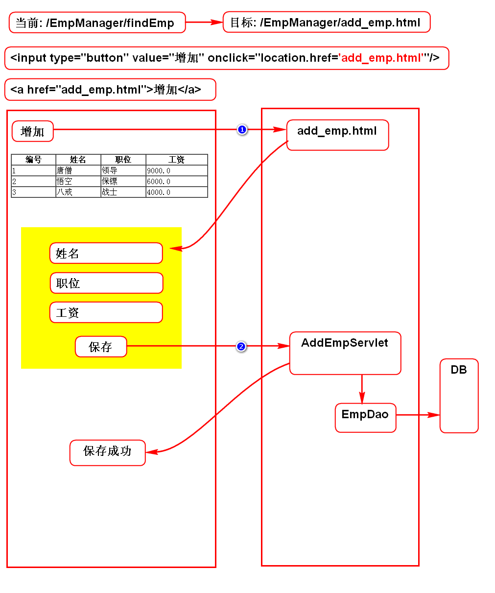

# 注册案例

# Servlet原理

# 请求方式
## 什么是请求方式
就是浏览器向服务器发送请求传递数据的方式

## 需要掌握的2种方式
### get
1. 通过URL传参，参数可见
2. 隐私性差
3. URL大小有限制(2K)，因此只能传少量参数

### post
1. 通过实体内容传参，参数不可见
2. 隐私性好
3. 实体内容大小不受限制，可以传无限参数

### 使用场景
1. 默认的请求都是get请求
- 直接输入地址
- 点击超链接
- 表单默认的提交方式

2. get
向服务器索取(查询)数据时用get请求

3. post
向服务器提交(保存)数据时用post请求

# 请求乱码解决方案
## 还原(get/post)
1. 用iso8859-1将乱码后的String还原成byte
2. 再将此byte用utf-8编成String
3. 优点：对get和post请求都有效
4. 缺点：太麻烦了

## 改server.xml(get)
1. 打开/tomcat/conf/server.xml，70行
2. 增加URIEncoding="utf-8"
3. 优点：简单
4. 缺点：有局限性

## 通过request设置解码(post)
1. 在获取请求参数前
	req.setCharacterEncoding("utf-8")

2. 优点：简单
3. 缺点：只对post有效

## 建议
1. get请求避免传中文
2. post请求采用第3种方案解决乱码问题

# 响应乱码解决方案
## 设置编码
res.setCharacterEncoding("utf-8")

## 设置解码
res.setContentType("text/html;charset=utf-8")

## 默认值
只需要设置解码，编码自动和解码保持一致

# 乱码总结
1. get请求避免传中文
2. post请求通过req设置解码
	req.setCharacterEncoding("utf-8")
3. 响应时
	res.setContentType("text/html;charset=utf-8")

# 查询员工

# 增加员工
