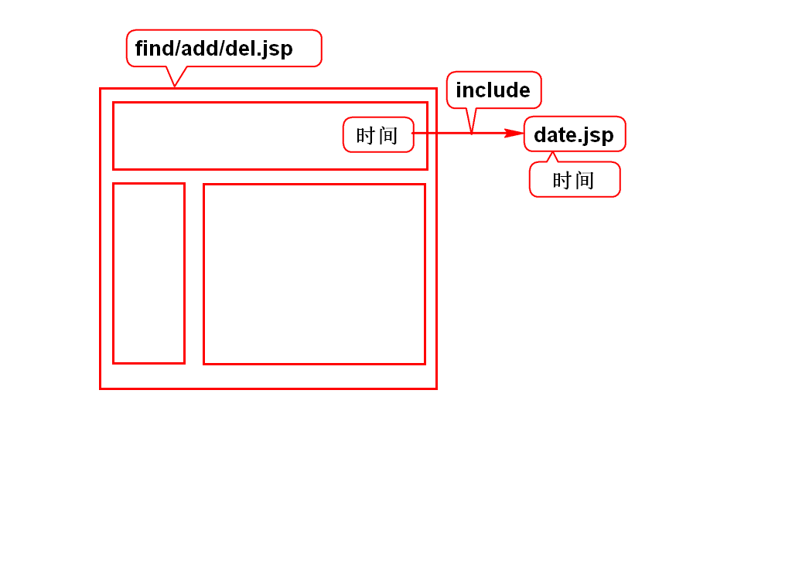
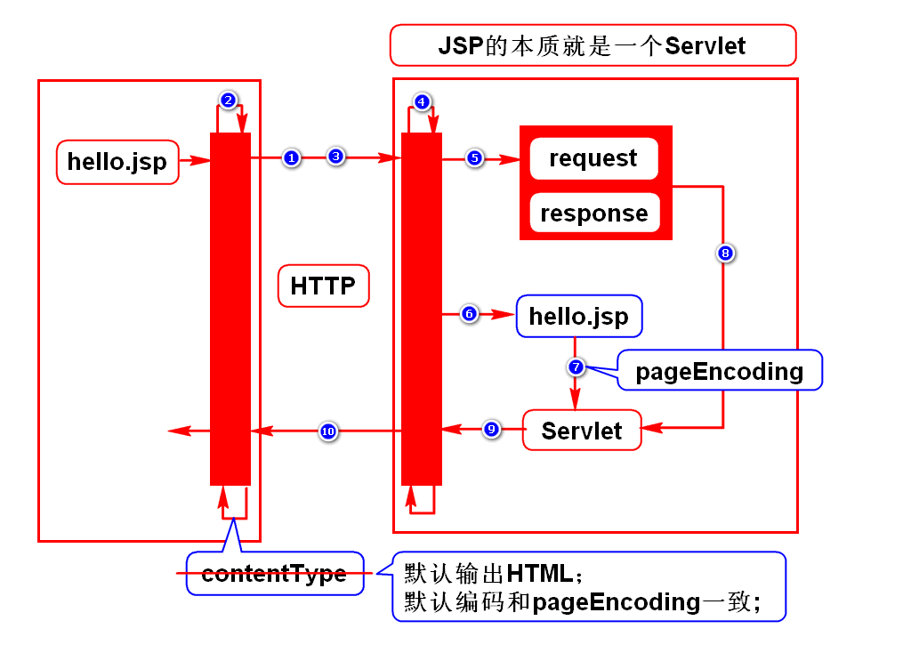
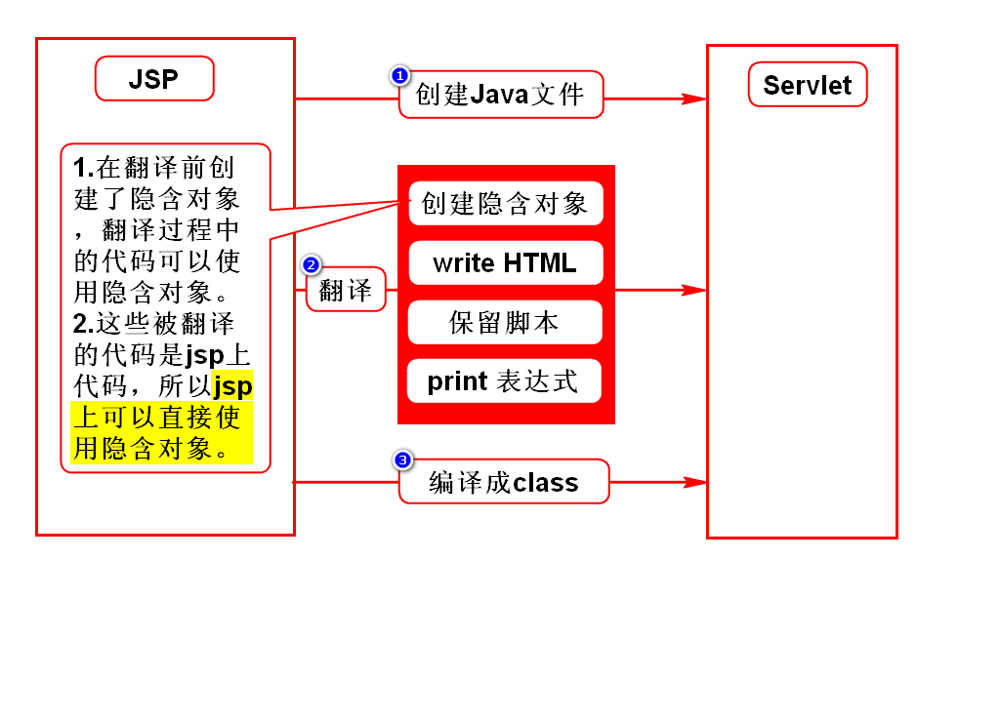
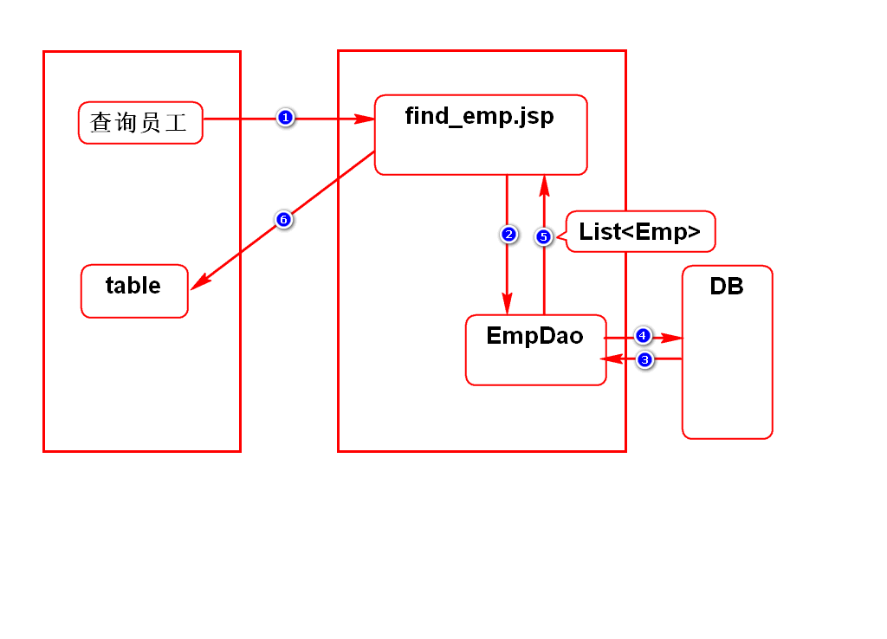
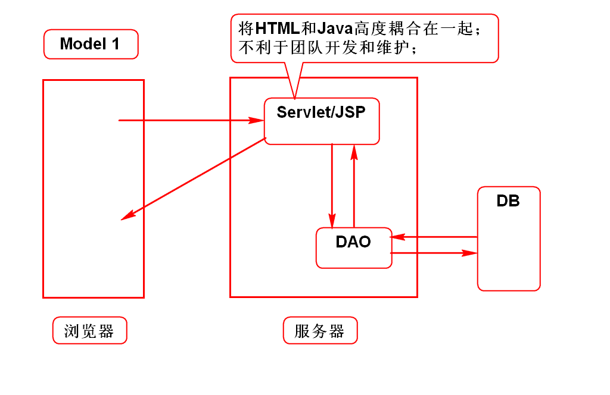
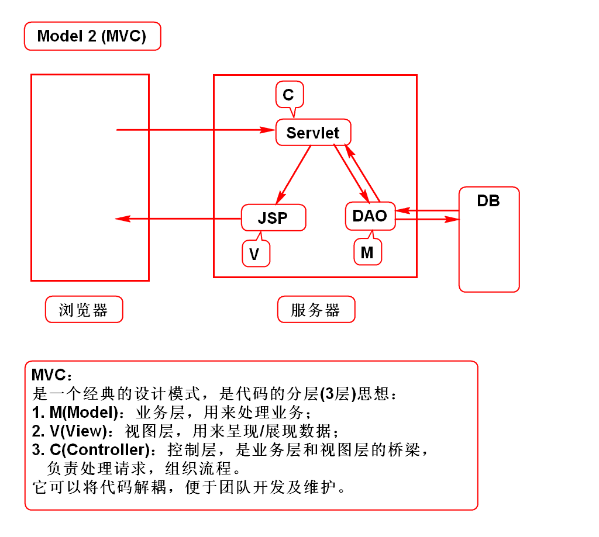
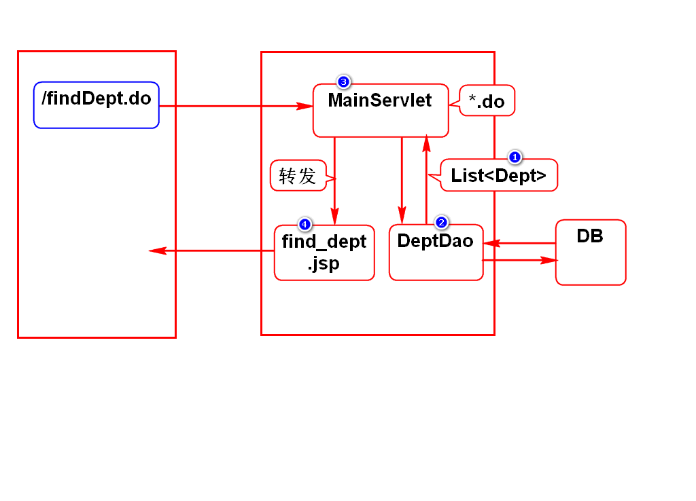
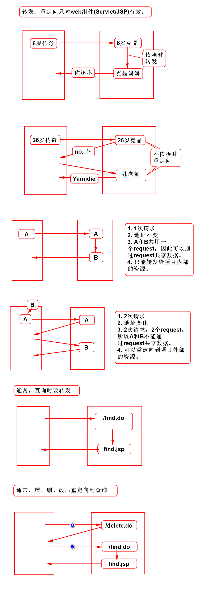

# index.jsp
1. web.xml中有welcome-file-list配置
2. 内部可以配置多个欢迎页
3. 访问这个项目，Tomcat会依次查找欢迎页
- index.html
- index.jsp
- zhuye.html
- zhuye.jsp

# include

# jsp运行原理

# jsp翻译过程

# 查询员工

# jsp隐含对象
## request(*)
- 类型：HttpServletRequest

## response
- 类型：HttpServletResponse

## out
- 类型：JSPWriter(等价于PrintWriter)

## config
- 类型：ServletConfig

## application
- 类型：ServletContext

## exception
- 类型：Throwable
- 页面发生异常时才能使用

## session(*)
- 类型：HttpSession
- 将来再讲

## page
- 类型：Object
- 指代当前的页面，相当于this

## pageContext(*)
- 类型：PageContext
- 是页面的环境，页面的管家
- 可以给页面提供数据
- 实际上通过此对象可以获得其他8个隐含对象

## 使用方式
	<%String s = request.getParameter("");%>
	<%=request.getParameter("")%>

# Model 1

# Model 2

# 查询部门

# 转发和重定向
