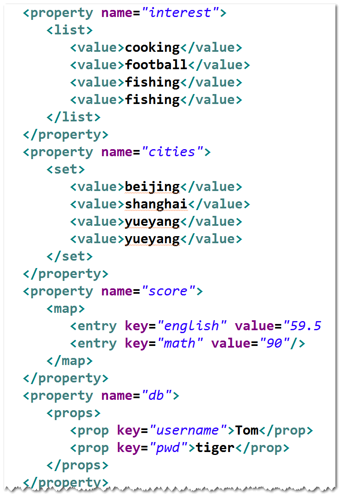

# 自动装配(了解)

## 什么是自动装配?
容器依据指定规则，自动完成对象之间依赖
关系的建立。

## 如何自动装配?
1. 默认情况下，容器不会自动装配。
2. autowire属性用来指定自动装配的规则，
有三个值:
. byName 容器查询id为属性名的bean,然后调用set方法来完成注入。
		注：
		a. 有无参构造器,有set方法。
		b. 没有符合条件的bean,注入null。
. byType 容器查找和属性类型一致的bean,然后调用set方法来完成注入。
		注：
		a. 有无参构造器,有set方法。 
		b. 没有符合条件的bean,注入null。
		c. 如果有多个符合条件的bean,会出错。
. constructor 容器查找和属性类型一致的bean,	然后调用构造器来完成注入。
		注：
		a. 要有有参构造器。
		b. 没有符合条件的bean,注入null。
		c.如果有多个符合条件的bean,不会出错。
. 自动装配要少用,容易出错。

# 注入基本类型的值
使用value属性注入即可。	

# 注入集合类型的值
使用List,Set,Map和Props元素来注入

# 将集合当做一个bean来配置

# 使用注解
## 使用注解的好处
随着bean的增多，配置文件会变得越来越大，不
方便维护。可以使用注解来代替配置文件中的部
分配置信息。

## 如何使用注解
step1. 配置组件扫描。

step2. 将相应的注解添加到类前面
@Component 通用注解
@Service	业务层注解
@Repository 持久层注解
@Controller	控制层注解
注：以上注解只是语义上的差别，都可以用。

## 使用注解来指定作用域,生命周期方法和延迟加载

## 使用注解来指定依赖注入关系
### @Autowired 和 @Qualifier
. @Autowire支持set方式注入和构造器注入
. @Qualifier指定被注入的bean的id。
如果不指定的话，容器会按照byType的方式来自动装配(有可能出错)。
. @Autowired也可以直接添加到属性前面，
此时，可以不提供相应的set方法。作用和写
在set方法上类似，但只会执行属性赋值语句。

